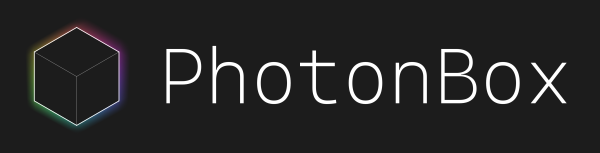

# 


[](https://github.com/Haeri/PhotonBox/actions)
[](https://github.com/Haeri/PhotonBox/blob/master/LICENSE)

A portable modern OpenGL Game-Engine with focus on PBR

## Project Goal

The PhotonBox Engine aims to be an open source resource for people interested in graphics and system architecture. The goal is to create a clean and readable codebase, whilst still maintaining good performance and a high graphical fidelity. An Editor is currently not planned as I am still exploring the possibilities for state based GUI solutions.

## Rendering

- Deferred/Forward Rendering
- Point lights, Directional lights, Spot lights
- SkyBox/Enviroment Mapping
- Parallax cubeMap correction
- Cook Torrance BRDF shader
  - Albedo Map
  - Normal Map
  - Roughness Map
  - Metallic Map
  - Ambient Occclusion Map
  - Emission Map
- Dynamic Irradiance & Specular-Convolution generation
- Post Processing List
  - Eye adaptation
  - Bloom
  - Tone mapping
  - SSAO
  - SSReflections
  - Temporal anti aliasing
- Transparent/Cutout rendering
- Shadow mapping
- Contact shadows
- Volumetric Fog
- Text rendering

## Systems

- Component system
- Scene system
- Generic Materials
- Lightprobe volumes
- Resource caching
- Async resource loading
- Shader hot reload
- PhysX 3.4 partial integration
- ImGui integration

## Project Setup

### Requirements
- [CMake 3.3^](https://cmake.org/download/) 
- [Python 3^](https://www.python.org/downloads/)

###  Windows

Generate the visual studio project file:
```cmd
git clone https://github.com/Haeri/PhotonBox.git --recursive
cd PhotonBox
./tools/setup_win.bat
```
<sub>Make sure to open the Visual Studio project as administrator, as it needs to perform copy operatiosn to make resources files available to the binaries.</sub>


###  Linux

Generate the make files:
```sh
git clone https://github.com/Haeri/PhotonBox.git --recursive
cd PhotonBox
sudo apt update
sudo apt install -y mesa-common-dev mesa-utils libgl1-mesa-dev
sudo apt install -y cmake curl unzip tar 
./tools/setup_nix.sh
```


###  Mac

Generate the xcode project file:
```bash
git clone https://github.com/Haeri/PhotonBox.git --recursive
cd PhotonBox
./tools/setup_nix.sh
```

## Media

Interiour

<sub>(Assets not distributed)</sub>

Automotive


## Roadmap

### RENDERING

- Instanced rendering
- Deferred decals
- GTAO
- Anisotropic filtering

### GENERAL

- Precompile shader
- Abstraction layer over OpenGL
- Precompiled headers
- Switch to dynamic library compilation
- Decoupling asset conversion from engine
- Doxygen integration for documentation

### OPTIMIZATION

- Uniform buffer
- SIMD math
